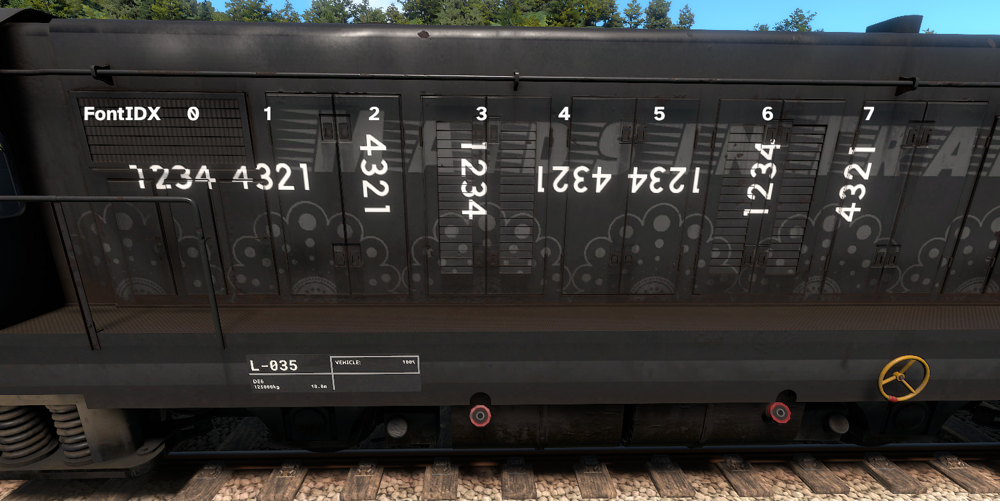

# dv-numbermanager-bmfont

maybe this will help someone besides me? I doubt it but hey. This is a tool that converts font sheets generated by [BMFont](https://www.angelcode.com/products/bmfont/) into a format
compatible with the lovely derail valley [Number Manager](https://github.com/katycat5e/NumberManager) mod. This saves you from having to make 10,000 restarts as you struggle to get 
your numbers in the right spot for the xml.

## Usage

This is a php script, so you'll need that. On windows you'll also need to grab imagemagick and the PECL extension for it. You'll also need composer. If there's interest I might 
make this into a webpage but, y'know, niche utility that nobody but me probably needs. Lemme know I guess

Once that's done, put your BMfont .fnt file and the image map into the directory and run the following:

```bash
 # only do this once to install deps
composer install

php convert.php your_bmfont_config.fnt
```

It should spit out a num.png and a numbering.xml for you to use! Note that you'll obviously still need to make some edits to the xml (and of course any modifications/effects on the 
image) but at least you won't need to do the horrible x/y/width stuff for each number.

## BMFont expected format

Because of the limitations of NumberManager and my jank-ass code, there's a couple restrictions you need to abide by when using BMFont:

**Font Settings**
* Match char height should be CHECKED

**Export Options**
* Force offsets to zero should be CHECKED
* Texture width/height:
  * Must be sized such that your numbers all fit on a single tile
  * Must be square
  * Must be a power of 2 (128, 256, 512, etc)
  * Get this as small as you can but with everything fitting on a single tile.
* Bit depth: `32` (unless you know what ur doing)
* Channel A: `glyph` (unless you know what ur doing)
* Channel R,G,B: `one` (unless you know what ur doing)
* File format font descriptor: `XML`
* Textures: `PNG`

## What it makes

The utility automatically makes rotated versions of your textures for skins that need it, as well as 8 total font indexes for you to use. Most of the time you wont need this many, 
but some locos (like for example the DH4) have weird backwards textures. A comment containing a list of generated indexes is given in the XML.

Here's a screenshot of what it looks like on a normal, right-way-up texture (the side of the DE6):



